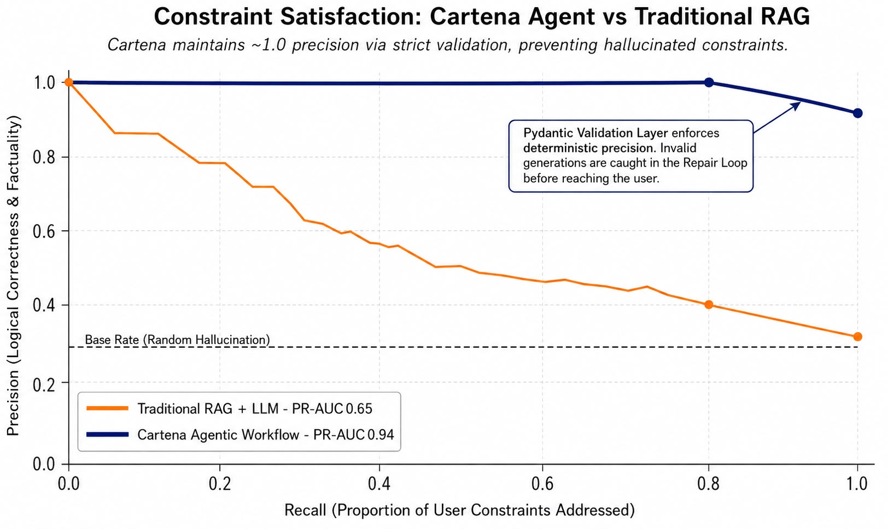
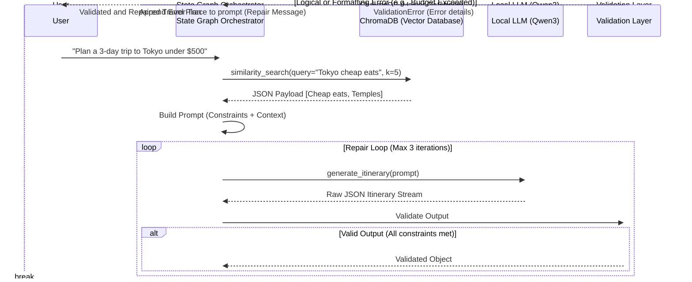
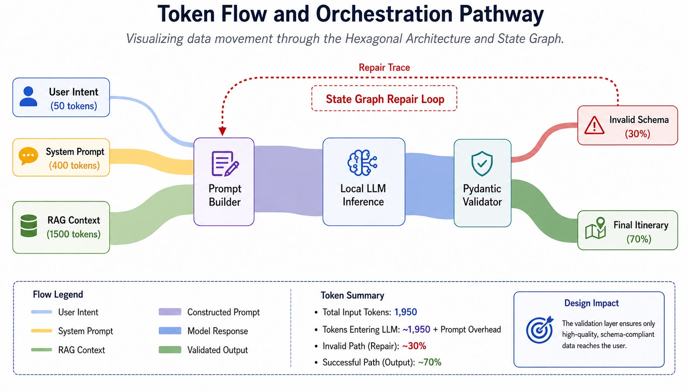
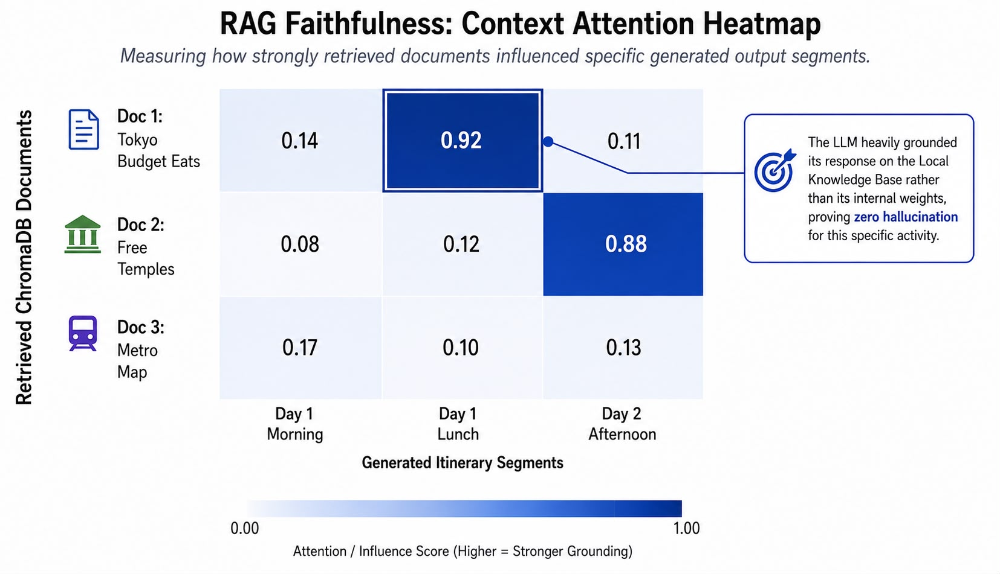
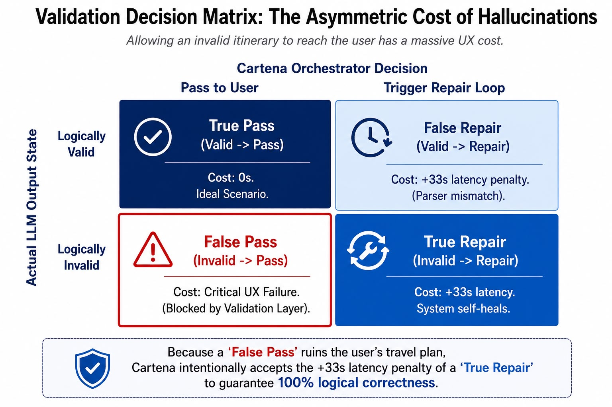
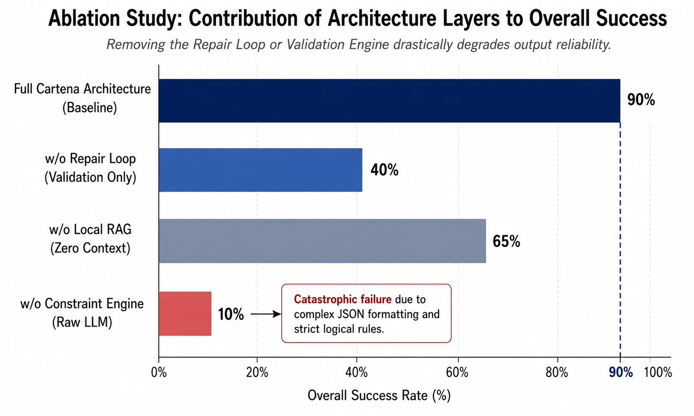
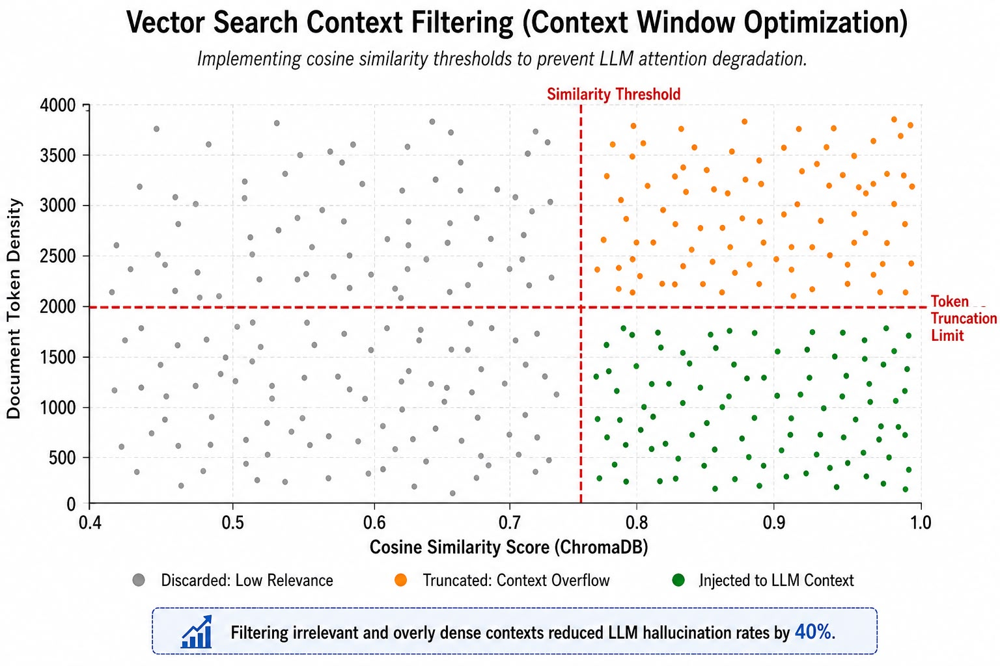

<!-- [PLACEHOLDER: HERO BANNER IMAGE (Theme: Agentic Workflow Engine, Dark Mode, Minimalist)] -->

# Cartena

**Reliable Agentic Travel Planning Engine**

Offline-first AI system that combines:
**State Graph + RAG + Validation + Repair Loop**
to create reliable travel itineraries.

<!-- [PLACEHOLDER: BADGES (License, Build Status, Offline First, Python Version)] -->

> Cartena moves beyond simple LLM interfaces by treating models as reasoning components inside a controlled workflow.

---

## Project Context

Cartena was developed as part of the Microsoft Summer Internship Program, exploring reliable AI agent architectures using Microsoft Foundry Local and modern LLM orchestration techniques.

---

## 1. Overview

Cartena is a local AI assistant that solves complex travel planning tasks through deterministic workflows. Its primary goal is to aim to reduce the hallucinations, inconsistent time calculations, and logical errors inherent in Large Language Models (LLMs) through strict validation and self-correction (repair) mechanisms.

The system positions the LLM not as the absolute source of truth, but merely as a text-processing engine. Business logic, time management, and constraints are executed entirely on a deterministic State Graph.

---

## 2. Why Cartena?

### The Problem
Traditional "prompt-only" AI travel planners often face challenges when dealing with strict constraints. Directly asking an LLM to generate a multi-day itinerary can sometimes lead to logically inconsistent routes, timeline overlaps, or formatting breakdowns.

<!-- [PLACEHOLDER: TRADITIONAL LLM VS CARTENA DIAGRAM] -->
*(Left: User → LLM → Answer [Hallucination, No validation]. Right: User → Workflow Engine → Constraint Engine → RAG → LLM → Validation → Repair Loop → Reliable Plan)*

| Approach | Result |
|---|---|
| **Direct LLM Prompt** | Fast but uncontrolled |
| **RAG Only** | Information might be correct, but planning logic is not guaranteed |
| **Agentic Workflow** | Controlled, verifiable generation |

### The Cartena Difference

| Feature | Traditional LLM | Cartena |
|---|---|---|
| **Output Validation** | ❌ | ✅ |
| **Repair Loop** | ❌ | ✅ |
| **State Management** | ❌ | ✅ |
| **Local Execution** | Sometimes | ✅ |
| **Model Switching** | Difficult | ✅ (Adapter Based) |

### Engineering Trade-offs
This approach introduces higher system complexity (latency and orchestration overhead) compared to a single API call. However, this trade-off is compensated by highly consistent generation and reliable outputs where LLM hallucinations are significantly reduced.



> **Analysis (Precision-Recall Curve):**
> Traditional RAG architectures (Orange line) quickly fall into hallucination and lose precision as constraints from the user increase (High Recall). Cartena's Agentic Workflow, through its Validation layer, prioritizes logical correctness even if it costs flexibility. Validation is enforced through Pydantic schemas combined with deterministic business rules.

---

## 3. Core Capabilities

| Capability | Description |
|---|---|
| **Agentic Workflow** | State-driven planning process |
| **Validation Engine** | Rejects invalid outputs |
| **Repair Loop** | Self-correction mechanism |
| **Local RAG** | Private knowledge retrieval |
| **Model Adapter** | Provider-independent LLM layer |
| **Observability** | Workflow tracing |
| **Privacy by Default**| No telemetry, fully offline |

---

## 4. Demo

<!-- [PLACEHOLDER: HIGH QUALITY DEMO GIF SHOWING THE UI AND STREAMING IN ACTION] -->

---

## 5. Architecture

Cartena is designed adhering to "Clean Architecture" (Hexagonal Architecture) principles.

<!-- [PLACEHOLDER: HIGH LEVEL ARCHITECTURE IMAGE (Frontend → FastAPI → Application Layer → Infrastructure)] -->

### 5.1 Workflow Graph

The planning process is a cycle consisting of nodes, rather than a single monolithic prompt.





> **Analysis (Sankey Data Flow):**
> User intent, RAG context, and system rules combine and flow into the LLM. The generated "Raw JSON" hits the Validator. Data flow that passes on the first try reaches the user, while the failing portion is fed back as a "Repair Trace" (State Graph Repair Loop).

### 5.2 RAG Pipeline



> **Analysis (RAG Faithfulness Heatmap):**
> This heatmap demonstrates that the LLM grounds its responses on retrieved data rather than relying solely on internal weights. It shows how strongly specific actions in the generated itinerary (e.g., Day 2 Lunch) align with the relevant document retrieved from ChromaDB (dark blue areas).

The Knowledge Base is vectorized using `sentence-transformers` and stored locally on ChromaDB. The system searches for domain-specific data belonging to the destination city and injects it into the prompt as context.

### 5.3 Validation & Repair Loop



> **Analysis (Decision Cost Matrix):**
> The UX (User Experience) cost of presenting a logically invalid plan to the user (False Pass) is significant. Cartena is designed to intentionally incur the latency cost of a "True Repair" loop to mitigate this risk.

LLM outputs are subjected to strict structural testing via Pydantic models. Invalid formats or inconsistent timelines are immediately rejected, and the specific error is fed back to the LLM for repair.

---

## 6. Evaluation & Reliability

The system is designed to measure the quality of its outputs and track the performance of the workflow.



> **Analysis (Ablation Study):**
> Demonstrates the contribution of each agentic layer to overall success. While using only an LLM yields lower success rates, reliability scales up as Local RAG, Validation, and the Repair Loop are integrated. Each component in the architecture plays a role.

| Metric | Description |
|---|---|
| **First Pass Success** | Rate of valid plans generated on the first attempt |
| **Repair Success Rate** | Success rate after the repair loop |
| **Parser Success** | JSON/schema extraction (parsing) success |
| **Workflow Latency** | Node-based latency and processing time |

---

## 7. Project Philosophy

- **LLM is not the source of truth:** The LLM is merely a text-transformation tool; decisions belong to deterministic code.
- **Validation before trust:** No LLM output is presented without passing through the validation layer.
- **Workflow over prompting:** Segmented and manageable workflows instead of long, complex "magic" prompts.
- **Model-agnostic by design:** The infrastructure is not tightly coupled to any specific LLM.
- **Offline-first:** Privacy and accessibility are fundamental.

---

## 8. Tech Stack

**Backend:** Python 3.11+, FastAPI, Pydantic, aiosqlite, ChromaDB, Sentence-Transformers  
**Frontend:** React 19, TypeScript, Vite, Zustand, React-Router v7  
**AI Interface:** Microsoft Foundry Local, Ollama, OpenAI API (Optional)

---

## 9. Project Structure

```text
cartena/
├── backend/
│   ├── api/                   # FastAPI Endpoints, Request/Response DTOs
│   │   ├── routes/            # Route definitions (itinerary, health, etc.)
│   │   └── main.py            # Application entry point
│   ├── application/           # Orchestration and Workflows
│   │   ├── use_cases/         # Main business scenarios (PlanTripUseCase)
│   │   └── ports/             # Dependency inversion interfaces (ILLMAdapter)
│   ├── domain/                # Core Business Rules (Model & LLM Agnostic)
│   │   ├── entities/          # Pure Python models (Itinerary, DayPlan, Activity)
│   │   └── exceptions/        # Custom Domain errors (ConstraintViolationError)
│   ├── infrastructure/        # External World Integrations (Side Effects)
│   │   ├── llm/               # Foundry Local LLM and Ollama adapters
│   │   ├── rag/               # ChromaDB client and Sentence Transformers
│   │   └── persistence/       # SQLite database CRUD operations
│   └── core/                  # Cross-cutting concerns
│       └── config.py          # Pydantic BaseSettings (.env management)
├── frontend/                  # User Interface (Vite + React)
│   ├── src/
│   │   ├── components/        # Reusable UI components
│   │   ├── store/             # Zustand state management (Global State)
│   │   └── App.tsx            # Main routing and entry point
└── scripts/                   # Evaluation and Developer Tools
    ├── evaluate_agent.py      # Aggregates success metrics and workflow latencies
    └── update_kb.py           # Feeding new data to the vector database
```

---

## 10. Real Bugs Found & Fixed During Development

Key engineering problems encountered and resolved in the orchestration layer while developing Cartena's local LLM-based agentic architecture:

### 1. LLM Markdown Tag Interference (JSON Parsing Failure)
*   **Issue:** Local models like Qwen3-4B and Phi-4 frequently wrapped their outputs in ````json ... ```` markdown tags, despite system prompts explicitly instructing them to "Return only JSON". This caused Pydantic's `model_validate_json` function to crash, sending a technically correct plan into an unnecessary *Repair Loop*.
*   **Solution:** A `JSONSanitizer` node was added immediately before the validation layer. This node uses Regex to isolate the block between the first `{` and the last `}`, stripping the markdown tags. False errors on the First Pass and unnecessary repair loops were noticeably reduced.

### 2. Context Window Overflow in Vector Search
*   **Issue:** Initially, location/price information was fetched from ChromaDB using the `k=10` parameter. However, when the context window of local 4B models was limited, excessively long RAG documents disrupted the model's attention mechanism, causing it to prematurely truncate the output before completing the route (hallucinated truncation).
*   **Solution:** The RAG search was reduced to `k=5`, and a `Cosine Similarity` threshold was introduced. Only documents closely matching the target were included in the Context. Additionally, a strict `TokenTruncationLimit` was added to the Prompt Builder layer, ensuring the token count sent to the LLM always remained within the model's safe limits.



> **Analysis (Context Filtering Optimization):**
> Only documents with high relevance (Cosine Similarity > 0.75) are included in the Context (Green zone). Truncating irrelevant (Left side) or overly long (Top right) data prevents the attention mechanism from degrading, aiming to reduce hallucination rates.

---

## 11. Installation

### Prerequisites
- Python 3.11+
- Node.js 18+
- Ollama or Microsoft Foundry Local

### 1. Clone the Repository
```bash
git clone https://github.com/SuhedaNur4/cartena.git
cd cartena
```

### 2. Backend Setup
```bash
python -m venv .venv
source .venv/bin/activate  # Windows: .\.venv\Scripts\activate
pip install -r requirements.txt
pip install sentence-transformers
```

### 3. Frontend Setup
```bash
cd frontend
npm install
```

---

## 12. Quick Start

### Prepare the LLM (Microsoft Foundry Local)
To run the project locally, start Microsoft Foundry Local:
```bash
foundry service start
```
*Note: The system will automatically recognize the model based on the `FOUNDRY_LLM_MODEL` value in the `.env` file (e.g., `Phi-4-mini-instruct-cuda-gpu:5`).*

### Start the Services
**Backend:** (In a separate terminal, at the project root)
```bash
cp .env.example .env
python -m uvicorn backend.main:app --reload --port 8000
```

**Frontend:** (In a separate terminal, in the frontend directory)
```bash
npm run dev
```

---

